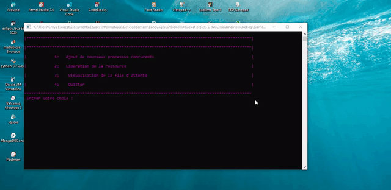
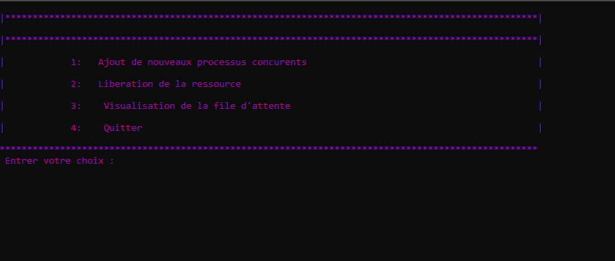

# Semaphore-Implementation
A C-based implementation of the OS  Semaphore technique: concurrecnt processes, shared-ressources, waiting queue

## Prequisites
- Code blocks IDE or equivalent

## Demo

## Run
- Create a project
- Include src files
- build and run your app

Here is the welcoming page:

    Any trouble or insight? feel free to open an issue.
